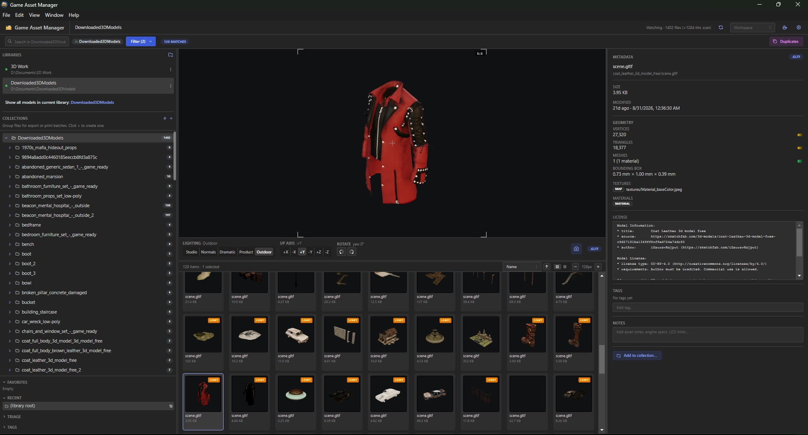

# Game Asset Manager

> Forked from [mthorson](https://github.com/mthorson) by [iam-aydin](https://github.com/iam-aydin) and restructured as **Game Asset Manager** to focus specifically on game asset organization and workflow management.

A desktop browser and organizer for game assets and 3D model files.

### Supported File Formats

Currently supported 3D model formats:
**fbx, gltf, glb, obj, stl, ply, 3mf**

> ⚠️ **Current Limitations & Future Roadmap:**
> Support for **audio files** (e.g., `.wav`, `.mp3`), **standalone image files** (e.g., `.png`, `.jpg`), and **text note files** (e.g., `.txt`) is planned for a future update. At present, these file types will not appear in the asset browser.

Is your collection of FBX models, GLTF assets, and 3D environment files a dumpster fire? Well then, this app is for you!

---

## What's in it

Open one or more folders as "libraries". Each library gets its own SQLite database (`.meshFlask.db` at the library root) tagged with a UUID; the per-machine mount path lives in your user app data. Move the library between machines and the app reconnects by UUID — you just edit one line in `libraries.json`.

Once a library is attached, you get:

* **Virtualized thumbnail grid** (scales gracefully to libraries with thousands of files) plus a dense list view.
* **Hierarchical tags**. Tag something `characters/heroes/Aragorn` and it shows up under all three tags.
* **1–5 star ratings and 5 color labels**. Keyboard shortcuts: `1`–`5` for stars, `Cmd+1`..`Cmd+5` for color labels, `Cmd+0` to clear.
* **Free-text notes per file** with debounced auto-save.
* **Manual collections & smart collections** (saved filter queries).
* **Per-file orientation override** (models that import sideways stay fixed across sessions).
* **Interactive 3D preview** with five lighting presets, four render quality tiers, and a "capture current view as thumbnail" button that remembers camera angle settings.
* **Fast search** across filename + tags + parsed metadata using SQLite FTS5.
* **Fullscreen preview (`Space`)**, 2-up compare with synced cameras, batch rename, ZIP, and contact-sheet export.
* **File operations**: Drag a file onto a folder to move it, `Cmd+D` to duplicate, `Delete` to send to trash (with confirmation).
* **External-app launcher** with CLI template support (`{file}`, `{profile}`) so external tools or DCC engines can be invoked from the right-click menu.

Built with Electron, runs on macOS, Windows, and Linux. See [Packaging a release](https://www.google.com/search?q=%2523packaging-a-release&utm_source=gemini) for installer scripts.

---

## Running it locally

```sh
npm install
npm run dev

```

`npm install` automatically rebuilds `better-sqlite3` against Electron's Node ABI (via the `postinstall` script). That's good for running the app and bad for the test suite, because vitest runs in system Node. If you want to run tests, use:

```sh
npm run test:full

```

which rebuilds `better-sqlite3` for system Node, runs vitest, then rebuilds back for Electron. Plain `npm test` will fail with an ABI mismatch error if you haven't manually rebuilt first.

`npm run typecheck` and `npm run build` don't touch the native module and are always safe.

### Packaging a release

```sh
npm run dist        # builds for the current platform
npm run dist:mac    # macOS DMG + zip, arm64 + x64
npm run dist:win    # Windows NSIS installer, x64 (cross-builds from Mac)
npm run dist:linux  # Linux AppImage, x64

```

Output lands in `release/`. Binaries are **unsigned** — macOS Gatekeeper will block the DMG on first open until you right-click → Open, and Windows SmartScreen will warn users.

The app icon is generated from `build/icon.svg` (matches the in-app logo). `npm run build:icon` re-renders the PNG at 1024×1024 via `sharp`; electron-builder converts that into the platform-specific `.icns` / `.ico` at packaging time.

### Sandbox shells

Some environments (CI runners, certain sandboxed terminals) set `ELECTRON_RUN_AS_NODE=1`. If that's in your env, Electron refuses to launch as a GUI and the dev server dies with a `Cannot read properties of undefined (reading 'isPackaged')` error. Unset it:

```sh
unset ELECTRON_RUN_AS_NODE
npm run dev

```

---

## Adding a library

Click the **+** in the sidebar, pick a folder. The app writes `<folder>/.meshFlask.db` and records the folder's mount path in your user app data:

* **macOS:** `~/Library/Application Support/meshFlask/`
* **Windows:** `%APPDATA%/meshFlask/`

Two files live there:

* `libraries.json` is a UUID → mount-path map. If you move a library to a different machine, edit this file to reconnect.
* `preferences.json` holds global settings — units, external apps, NAS poll interval, render quality, and profiles.

Quit and relaunch reopens every library you had attached. Libraries remember per-machine UI state via `localStorage` keyed on the library UUID.

---

## Architecture

Three Electron processes:

1. **Main** — owns the SQLite connection (`better-sqlite3`), filesystem watcher (`chokidar`), thumbnail worker pool, and external-app launching.
2. **Renderer** — the visible UI (React + Mantine with a Three.js viewer).
3. **Thumbnail workers** — off-screen `BrowserWindow` instances that render models to PNGs in the background.

The renderer uses custom Electron protocols: `wh3d-thumb://` for tile images and `wh3d-file://` for raw model bytes.

---

## Known rough edges

* **Background thumbnail rendering is pinned to "Low" quality** regardless of the render-quality preference. Capturing a thumbnail manually from the preview pane uses current quality settings.
* **Packaged builds are unsigned.** Code signing certificates must be configured separately for distributed builds.
* **No cross-library view.** Queries are currently scoped to one library at a time.

---

## Layout

```text
src/
  main/             Electron main process
    db/             better-sqlite3 wrapper, migrations, repos
    libraries/      Open/close/rename/remove libraries; the registry
    scanner/        Initial walker + chokidar watcher
    thumb-pool/     Hidden BrowserWindow pool + queue runner
    preferences/    preferences.json read/write
    cache/          Thumbnail cache rebuild + purge
    ipc/            Typed IPC handlers
    protocol/       wh3d-thumb:// + wh3d-file:// handlers
  renderer/         React UI + Three.js viewer
    components/     Sidebars, modals, panels, widgets
    three/          ModelViewer, lighting rig, loaders, validation
    util/           usePreferences hook, formatters
  preload/          contextBridge → typed IpcApi
  shared/           Pure modules used by every process: paths, types,
                    sort, ratings, smart-query, rename-template, ...

```

---

## Tests

```sh
npm run test:full

```

Coverage targets core utilities: path resolution, SQLite queries, folder-tree construction, FTS triggers, rename detection, smart-collection validation, ratings, and orientation mapping.
